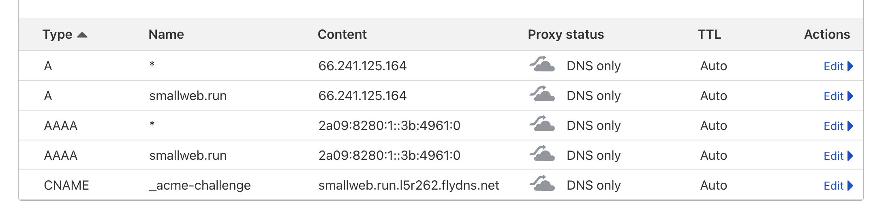

# Hosting Smallweb on fly.io

```sh
git clone https://github.com/pomdtr/smallweb
fly launch --no-deploy
fly deploy
fly certs create '<your-domain>' # Optional, might be used in the future
fly certs create '*.<your-domain>'
```

Then add the required dns entries to your domain registrar.



The certificate might take a long time to be issued (~30 mins in my experience).
You can check the status of the certificates by running `fly certs show '*.<your-domain>'`.

## Testing the setup

Create a dummy website:

```sh
fly ssh console
mkdir -p /www/example
CAT <<EOF > /www/example/main.ts
export default {
  fetch() {
    return new Response("Smallweb is running on fly.io", {
      headers: {
        "Content-Type": "text/plain",
      },
    });
  }
}
EOF
```

Then go to `https://example.<your-domain>`.

You can access the smallweb logs by running: `fly logs` in the smallweb directory, or `fly logs -a smallweb` from anywhere.
