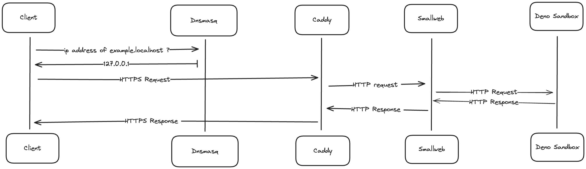

This page will guide you through the process of setting up your local environment for smallweb on MacOS.

At the end of this process, each folder in `~/www` will be mapped to domain with a `.localhost` suffix. For example, the folder `~/www/example` will be accessible at `https://example.localhost`.

This setup is useful for developing and testing smallweb apps locally, without having to deploy them to the internet.

If you want to expose your apps to the internet instead, you can follow the [Cloudflare Tunnel setup guide](../cloudflare/tunnel.md).

## Architecture

The following diagram illustrates the architecture of the local setup:



The components needed are:

- a dns server to map `.localhost` domains to `127.0.0.1` ip address (dnsmasq)
- a reverse proxy to automatically generate https certificates for each domain, and redirect traffic to the smallweb evaluation server (caddy)
- a service to map each domain to the corresponding folder in ~/www, and spawn a deno subprocess for each request (smallweb)
- a runtime to evaluate the application code (deno)

## Installation

In the future, we might provide a script to automate this process, but for now, it's a manual process.

### Install Brew (required to install smallweb, deno, caddy, and dnsmasq)

We'll use brew to install the required tools. If you don't have brew installed, you can run the following command:

```sh
/bin/bash -c "$(curl -fsSL https://raw.githubusercontent.com/Homebrew/install/HEAD/install.sh)"
```

### Install Deno (required to run smallweb apps)

```sh
# using brew
brew install deno
```

### Install smallweb

Download the lastest version of smallweb from the [github releases](https://github.com/pomdtr/smallweb/releases/latest), and extract it to a folder in your path.

```sh
# Create a dummy app to make sure smallweb is working
mkdir -p ~/www/example
CAT <<EOF > ~/www/example/main.ts
export default {
  fetch() {
    return new Response("Smallweb is running", {
      headers: {
        "Content-Type": "text/plain",
      },
    });
  }
}
EOF

# run smallweb in the background
smallweb service install
```

### Install Caddy (redirect *.localhost to localhost:7777)

```sh
# Install caddy
brew install caddy

# Write caddy configuration
cat <<EOF > /opt/homebrew/etc/Caddyfile
*.localhost {
  tls internal {
    on_demand
  }

  reverse_proxy localhost:7777
}
EOF

# Run caddy in the background
brew services start caddy

# Add caddy https certificates to your keychain
caddy trust

# Indicate to deno to use the keychain for tls certificates
echo "DENO_TLS_CA_STORE=system" >> ~/www/.env
```

### Install dnsmasq (map *.localhost address to 127.0.0.1)

```sh
# Install dsnmasq
brew install dnsmasq

# Write dnsmasq configuration
echo "address=/.localhost/127.0.0.1" >> /opt/homebrew/etc/dnsmasq.conf

# Run dnsmasq in the background
sudo brew services start dnsmasq

# Indicates to the system to use dnsmasq for .localhost domains
sudo mkdir -p /etc/resolver
cat <<EOF | sudo tee -a /etc/resolver/localhost
nameserver 127.0.0.1
EOF
```

## Testing the local setup

If everything went well, you should be able to access `https://example.localhost` in your browser, and see the message `Smallweb is running`.
